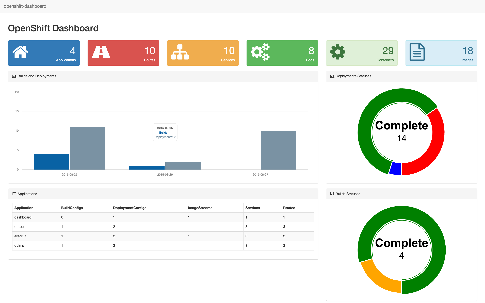

# OpenShift Dashboard

**Dashboard for visualization of multi-projects resources in OpenShift.**

[](https://hub.docker.com/r/vbehar/openshift-dashboard/)
[](https://godoc.org/github.com/vbehar/openshift-dashboard)
[](https://travis-ci.org/vbehar/openshift-dashboard)
[](https://circleci.com/gh/vbehar/openshift-dashboard/tree/master)

This is a web application that aims to display a nice dashboard of your resources across multiple projects in an [OpenShift](http://www.openshift.org/) instance.



## How It Works

It is a [Go](http://golang.org/) webapp that uses the OpenShift API to build a dashboard, based on [Start Bootstrap - SB Admin 2](https://github.com/IronSummitMedia/startbootstrap-sb-admin-2).

* If the application is running in a container **in an OpenShift Cluster**, it will connect to the OpenShift API Server using the information available from the environment (mainly the service account token secret).

* If the application is not running in an OpenShift Cluster, it uses the default configuration file to connect to the OpenShift API Server. So it requires that you **login with the `oc` client** before starting the application.

It displays a summary of the following resources:

* [Routes](https://docs.openshift.org/latest/architecture/core_concepts/routes.html#overview)
* [Services](https://docs.openshift.org/latest/architecture/core_concepts/pods_and_services.html#services)
* [Pods](https://docs.openshift.org/latest/architecture/core_concepts/pods_and_services.html#pods)
* [Containers](https://docs.openshift.org/latest/architecture/core_concepts/containers_and_images.html#containers)
* [Images](https://docs.openshift.org/latest/architecture/core_concepts/builds_and_image_streams.html#image-streams)
* [Builds](https://docs.openshift.org/latest/architecture/core_concepts/builds_and_image_streams.html#builds)
* [Deployments](https://docs.openshift.org/latest/architecture/core_concepts/deployments.html)
* and... **Applications**

### Applications

The dashboard also groups resources by **applications**. An application is just a logical wrapper for multiple resources. You can assign resources to an application by setting a label named `application` on each resource (object):

  ```
  - kind: SomeObject
    metadata:
      name: myobject
      labels:
        application: myapplication
  ```

The dashboard will then extracts all declared applications from the labels of your resources.

* **Why not use [projects](https://docs.openshift.org/latest/architecture/core_concepts/projects_and_users.html#projects) to represents applications**?
  * Because we could have multiple applications shared in a single project, or some projects which produces [builds](https://docs.openshift.org/latest/architecture/core_concepts/builds_and_image_streams.html#builds) and [images](https://docs.openshift.org/latest/architecture/core_concepts/builds_and_image_streams.html#image-streams), but are not applications.

## Running on OpenShift

If you want to deploy this dashboard on an OpenShift cluster, you can use the provided [template](openshift-template.yml), that will create all the required resources:

* a `dashboard` [Service Account](https://docs.openshift.org/latest/architecture/core_concepts/projects_and_users.html#users) that will be used by the running [pod](https://docs.openshift.org/latest/architecture/core_concepts/pods_and_services.html#pods)
* a [Build Config](https://docs.openshift.org/latest/architecture/core_concepts/builds_and_image_streams.html#docker-build) that will use the [Dockerfile](Dockerfile) to build the [Docker image](https://docs.openshift.org/latest/architecture/core_concepts/containers_and_images.html#docker-images)
* a [Deployment Config](https://docs.openshift.org/latest/architecture/core_concepts/deployments.html#deployments-and-deployment-configurations) that will deploy a simple [pod](https://docs.openshift.org/latest/architecture/core_concepts/pods_and_services.html#pods) with a single [container](https://docs.openshift.org/latest/architecture/core_concepts/containers_and_images.html#containers)
* a [Service](https://docs.openshift.org/latest/architecture/core_concepts/pods_and_services.html#services) in front of the [pod](https://docs.openshift.org/latest/architecture/core_concepts/pods_and_services.html#pods)(s)
* and a [Route](https://docs.openshift.org/latest/architecture/core_concepts/routes.html#overview) to expose the [service](https://docs.openshift.org/latest/architecture/core_concepts/pods_and_services.html#services) to the outside world

**Using the [template](openshift-template.yml) is very easy** (and the recommended way to install the dashboard on OpenShift):

* if you don't already have a project, create one

  ```
  oc new-project dashboard
  ```
* create a new application from the template, and override some parameters

  ```
  oc new-app -f https://raw.githubusercontent.com/vbehar/openshift-dashboard/master/openshift-template.yml -p APPLICATION_NAME=dashboard,DASHBOARD_TITLE="My OpenShift Dashboard",ROUTE_DNS=dashboard.somedomain.com
  ```

* if a build does not start, you can start one with

  ```
  oc start-build dashboard
  ```

* Wait a little for the build to finish, the following deployment to succeed, and... that's it! You can now open your browser at the configured route DNS, and you should have a nice dashboard.
* The next step is to give more rights to your [service account](https://docs.openshift.org/latest/architecture/core_concepts/projects_and_users.html#users) so that it can see other [projects](https://docs.openshift.org/latest/architecture/core_concepts/projects_and_users.html#projects): to do that, we will add the `view` role to our `dashboard` service account for all the projects you want to display in the dashboard

  ```
  oc policy add-role-to-user view system:serviceaccount:{DASHBOARD_PROJECT}:dashboard -n {NAME_OF_THE_PROJECT_TO_DISPLAY_IN_THE_DASHBOARD}
  ```

  for example, if the dashboard application is deployed in the `dashboard` projects, and you want to show projects `project1` and `project2` in the dashboard:

  ```
  oc policy add-role-to-user view system:serviceaccount:dashboard:dashboard -n myproject1
  oc policy add-role-to-user view system:serviceaccount:dashboard:dashboard -n myproject2
  ```

* The last step is to create [applications](#applications), by adding an `application` label to your objects.

**Alternatively**, you can just use the pre-build [Docker image hosted on Docker Hub](https://hub.docker.com/r/vbehar/openshift-dashboard/):

* create a new application from the `vbehar:openshift-dashboard` image

  ```
  oc new-app vbehar/openshift-dashboard
  ```
* expose the service through a new route

  ```
  oc expose service openshift-dashboard --hostname=dashboard.somedomain.com
  ```

Note that if you choose to deploy without the template, the [pod](https://docs.openshift.org/latest/architecture/core_concepts/pods_and_services.html#pods) will use the `default` [service account](https://docs.openshift.org/latest/architecture/core_concepts/projects_and_users.html#users), and you will need to either:

* create a new [service account](https://docs.openshift.org/latest/architecture/core_concepts/projects_and_users.html#users), edit the [deployment config](https://docs.openshift.org/latest/architecture/core_concepts/deployments.html#deployments-and-deployment-configurations) to configure the [pod](https://docs.openshift.org/latest/architecture/core_concepts/pods_and_services.html#pods) to use your new [service account](https://docs.openshift.org/latest/architecture/core_concepts/projects_and_users.html#users), and redeploy
* or give more rights to the `default` [service account](https://docs.openshift.org/latest/architecture/core_concepts/projects_and_users.html#users) (not recommended)

## Running locally

If you want to run it on your laptop:

* clone the sources in your GOPATH

	```
	git clone https://github.com/vbehar/openshift-dashboard.git $GOPATH/src/github.com/vbehar/openshift-dashboard
	```
* install 
	* [godep](https://github.com/tools/godep): for using the vendored dependencies

	  ```
	  go get github.com/tools/godep
	  ```
	* [gin](https://github.com/codegangsta/gin): for live-reloading the web server

	  ```
	  go get github.com/codegangsta/gin
	  ```
* configure the environment (in dev mode, caching is disabled)

  ```
  echo "GO_ENV=dev" > $GOPATH/src/github.com/vbehar/openshift-dashboard/.env
  ```
* Login with the `oc` client: it will create a config file that will be used by the dashboard app to connect to the OpenShift API.

	```
	oc login [...]
	```
* start the web server on port 8080 (don't forget the `--godep` option, to use `godep` to retrieve the vendored dependencies)

	```
	gin --godep --port 8080 run main.go
	```
* open <http://localhost:8080/>

## License

Copyright 2015 the original author or authors.

Licensed under the Apache License, Version 2.0 (the "License");
you may not use this file except in compliance with the License.
You may obtain a copy of the License at

    http://www.apache.org/licenses/LICENSE-2.0

Unless required by applicable law or agreed to in writing, software
distributed under the License is distributed on an "AS IS" BASIS,
WITHOUT WARRANTIES OR CONDITIONS OF ANY KIND, either express or implied.
See the License for the specific language governing permissions and
limitations under the License.
